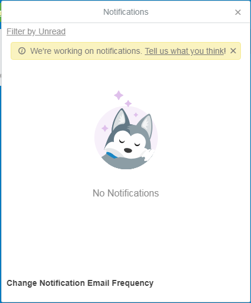

<!DOCTYPE html>
<html lang="en">

<head>
  <meta charset="utf-8">
  <meta name="viewport" content="width=device-width, initial-scale=1, minimum-scale=1, maximum-scale=1, user-scalable=yes">
  <meta name="format-detection" content="telephone=no">
  <meta name="description" content="">
  <meta name="keywords" content="">
  <meta property="og:title" content="">
  <meta property="og:type" content="website">
  <meta property="og:url" content="">
  <meta property="og:image" content="">
  <meta property="og:site_name" content="">
  <meta property="og:description" content="">

  <title>Trello</title>
  <link rel="stylesheet" href="https://stackpath.bootstrapcdn.com/bootstrap/4.1.3/css/bootstrap.min.css" integrity="sha384-MCw98/SFnGE8fJT3GXwEOngsV7Zt27NXFoaoApmYm81iuXoPkFOJwJ8ERdknLPMO" crossorigin="anonymous">
  <!-- <link rel="stylesheet" href="https://stackpath.bootstrapcdn.com/bootstrap/3.3.6/css/bootstrap.min.css" > -->
  
  <link rel="stylesheet" href="js/jquery-ui/jquery-ui.min.css">
  <link rel="stylesheet" href="css/style.css" media="all">
  <link rel="stylesheet" href="css/responsive.css" media="all">
  

</head>

<body>

  <section class="body-container">

    

      

        <h3>Boards</h3>
      

      

        

          <input type="text" class="f-control">
        

        

          

            
No Boards

          

          

            

              <i class="far fa-star"></i>
              Starred Boards
              
                <a href="#" class="lg-icon dark-hover"><i class="fas fa-plus"></i></a>
                <a href="#" class="lg-icon dark-hover hide"><i class="fas fa-minus"></i></a>
              
            

            

              

                Star your most important boards to keep them right at your fingertips.
              

              <ul class="sidebar-boards-list">
                <li class="list-board__item">
                  

                    
                    <a href="#" class="compact-board-link">
                      
                      demo
                      
                        
                        
                          <i class="far fa-star"></i>
                        
                      
                    </a>
                  

                </li>
              </ul>
              

                <a href="" class="quiet-btn">Show less active boards (0)</a>
              

            

          

          

            

              <i class="far fa-clock"></i>
              Recent Boards
              
                <a href="#" class="lg-icon dark-hover"><i class="fas fa-plus"></i></a>
                <a href="#" class="lg-icon dark-hover hide"><i class="fas fa-minus"></i></a>
              
            

            

              

              <ul class="sidebar-boards-list">
              </ul>
            

            

              
            

          

          

            

              <i class="fab fa-trello"></i>
              Personal Boards
              
                <a href="#" class="lg-icon dark-hover"><i class="fas fa-plus"></i></a>
                <a href="#" class="lg-icon dark-hover hide"><i class="fas fa-minus"></i></a>
              
            

            

              <ul class="sidebar-boards-list">

                <li class="list-board__item starred">
                  

                    
                    <a href="#" class="compact-board-link">
                      
                      demo
                      
                        
                        
                          <i class="far fa-star"></i>
                        
                      
                    </a>
                  

                </li>
                <li class="list-board__item starred">
                  

                    
                    <a href="#" class="compact-board-link">
                      
                      demo
                      
                        
                        
                          <i class="far fa-star"></i>
                        
                      
                    </a>
                  

                </li>

              </ul>
              

                <a href="" class="quiet-btn">Show less active boards (0)</a>
              

            

          

          

            

              <a href="#" class="dark-hover clickable">
                <i class="fas fa-user-friends"></i>
                demo
                <i class="fas fa-briefcase"></i>
              </a>
              
                <a href="#" class="lg-icon dark-hover"><i class="fas fa-plus"></i></a>
                <a href="#" class="lg-icon dark-hover hide"><i class="fas fa-minus"></i></a>
              
            

          

        

        

          <a class="quiet-btn js-open-window" src-window="new-board" href="#">Create new board…</a>
          <a class="quiet-btn js-keep-drawerboard" href="#">Always keep this menu open.</a>
          <a class="quiet-btn js-remove-drawerboard" href="#">Don’t keep this menu open.</a>
          <a class="quiet-btn" href="#">See closed boards</a>
        

      

    

    <section class="body-entry">
  
      <header id="header">
        

          

            <a href="#" class="mn-btn btn-1 header-boards js-open-drawerboard">
              <i class="fab fa-trello"></i>
              Bảng
            </a>
          

          

            

              <input type="text" class="f-control js-open-popover" src-popover="search-popover">
               <i class="fas fa-search"></i>
               <a href="#" class="icon icon-external-link"><i class="fas fa-external-link-alt"></i></a>
               <i class="fas fa-times"></i>
            

          

        

        

          

        

        

          

            <a href="#" class="mn-btn btn-1 js-open-popover" src-popover="create-popover">
              <i class="fas fa-plus"></i>
            </a>
          

          

            <a href="#" class="mn-btn btn-1 js-open-popover" src-popover="information-popover">
              <i class="fas fa-info-circle"></i>
            </a>
          

          

            <a href="#" class="mn-btn btn-1 js-open-window" src-window="mod-notifications-overlay">
              <i class="far fa-bell"></i>
            </a>
          

          

            <a href="#" class="member-menu js-open-popover" src-popover="member-menu-popover">
              
                ZL
                
              
            </a>
          

        

      </header>
    
      <main id="boards-page">
        

          

            

              
                

                  <a href="#" class="mn-btn title-btn js-open-popover" src-popover="rename-board-popover">
                    Web
                  </a>
                

                

                  <a href="#" class="mn-btn star-btn"><i class="far fa-star"></i></a>
                

                

                  

                    <a href="#" class="mn-btn desc-btn" src-menu="bhd-desc-menu"><i class="fas fa-bars"></i></a>
                  

                  

                    
                  

                  

                    <a href="#" class="mn-btn addteam-btn js-open-popover" src-popover="org-menu-popover">
                      Demo
                    </a>
                  

                  

                    
                  

                  

                    <a href="#" class="mn-btn perms-btn js-open-popover" src-popover="change-vis-popover">
                      <i class="fas fa-lock"></i>Riêng tư
                    </a>
                  

                  

                    
                  

                  

                    <a href="#" class="mn-btn collect-btn" src-menu="bhd-collect-menu">
                      <i class="fas fa-archive"></i>
                    </a>
                  

                

                

                  
                

                

                  

                    <a href="#" class="mn-btn btn-2 member-btn js-open-popover" src-popover="member-profile-popover">
                      AA
                      
                      
                    </a>
                  

                  

                    <a href="#" class="mn-btn btn-1 addmem-btn js-open-popover" src-popover="board-member-add-multiple">
                      <i class="fas fa-user-plus"></i>
                    </a>
                  

                

                

                  

                    <a href="#" class="mn-btn filter-btn" src-menu="bhd-filter-menu">
                      <i class="fas fa-filter"></i>Đang mở bộ lọc
                      <i class="fas fa-times"></i>
                    </a>
                  

                  

                    <a href="#" class="mn-btn subscribe-btn" src-menu="bhd-subscribe-menu">
                      <i class="fas fa-eye"></i>Đang theo dõi
                    </a>
                  

                  

                    <a href="#" class="mn-btn calendar-btn" src-menu="bhd-calendar-menu">
                      <i class="far fa-calendar-alt"></i>Lịch
                    </a>
                  

                  

                    <a href="#" class="mn-btn js-open-boardmenu">
                      <i class="fas fa-ellipsis-h"></i>
                      Hiện menu
                    </a>
                  

                

              
            

            

            

              

        
                

                  

                    

                      

                        <textarea class="f-control textarea-js-title" row="1">Thẻ A</textarea>
                      

                      

                        <i class="fas fa-eye"></i>
                        <i class="fas fa-ellipsis-h"></i>
                      

                    

                    

                      <a href="#" class="st-body-card ui-state-default js-open-window" src-window="detail-board">
                        

                          <i class="fas fa-pencil-alt"></i>
                          <i class="fas fa-expand-arrows-alt"></i>
                        

                        

                          

                            sadasd
                            sadassssssd
                          

                          

                            
Lorem ipsum dolor sit amet consectetur adipisicing elit. Rerum, corporis?
                              Lorem ipsum dolor sit amet consectetur adipisicing elit. Dolor unde magni eaque quidem quaerat.
                                Itaque deserunt iusto rerum! Alias, beatae.
                            

                          

                          

                            

                              <i class="fas fa-eye"></i>
                            

                            

                              <i class="far fa-clock"></i>29/6/2017
                            

                            

                              <i class="far fa-clock"></i>29/12/2017
                            

                            

                              <i class="fas fa-paperclip"></i>1
                            

                            

                              <i class="far fa-comment"></i>4
                            

                            

                              <i class="far fa-check-square"></i>1/2
                            

                            
                          

                          

                            

                              ZL
                              
                            

                          

                        

                      </a>
                      <a href="#" class="st-body-card ui-state-default js-open-window" src-window="detail-board">
                        

                          

                            
                          

                        

                        

                          <i class="fas fa-pencil-alt"></i>
                          <i class="fas fa-expand-arrows-alt"></i>
                        

                        

                          

                            
                          

                          

                            

                              <i class="fas fa-eye"></i>
                            

                            

                              <i class="far fa-clock"></i>29/6/2017
                            

                            

                              <i class="fas fa-paperclip"></i>1
                            

                            

                              <i class="far fa-comment"></i>4
                            

                            

                              <i class="far fa-check-square"></i>1/2
                            

                            
                          

                          

                            

                              ZL
                              
                            

                          

                        

                      </a>
                    

                    

                      Thêm thẻ
                      

                        

                          <textarea class="f-control"></textarea>
                        

                        

                          

                            <a href="" class="mn-btn controls-add">Thêm</a>
                            <a href="" class="mn-btn controls-close js-cancel-edit"><i class="fas fa-times"></i></a>
                          

                          

                            <a href="" class="mn-btn controls-menu"><i class="fas fa-ellipsis-h"></i></a>
                          

                        

                      

                    

                  

                

                

                  

                    

                      

                        <textarea class="f-control textarea-js-title">Thẻ A</textarea>
                      

                      

                        <i class="fas fa-eye"></i>
                        <i class="fas fa-ellipsis-h"></i>
                      

                    

                    

                      <a href="#" class="st-body-card ui-state-default js-open-window" src-window="detail-board">
                        

                          
                        

                        

                          <i class="fas fa-pencil-alt"></i>
                          <i class="fas fa-expand-arrows-alt"></i>
                        

                        

                          

                          

                            
Lorem ipsum dolor sit amet consectetur adipisicing elit. Rerum, corporis?
                            

                          

                          

                            

                              <i class="fas fa-eye"></i>
                            

                            

                              <i class="far fa-clock"></i>29/6/2017
                            

                            

                              <i class="fas fa-paperclip"></i>1
                            

                            

                              <i class="far fa-comment"></i>4
                            

                            

                              <i class="far fa-check-square"></i>1/2
                            

                            
                          

                          

                            

                              ZL
                              
                            

                          

                        

                      </a>
                    

                    

                      Thêm thẻ
                      

                        

                          <textarea class="f-control"></textarea>
                        

                        

                          

                            <a href="" class="mn-btn controls-add">Thêm</a>
                            <a href="" class="mn-btn controls-close js-cancel-edit"><i class="fas fa-times"></i></a>
                          

                          

                            <a href="" class="mn-btn controls-menu"><i class="fas fa-ellipsis-h"></i></a>
                          

                        

                      

                    

                  

                

                

                  

                    

                      

                        <textarea class="f-control textarea-js-title">Thẻ A</textarea>
                      

                      

                        <i class="fas fa-eye"></i>
                        <i class="fas fa-ellipsis-h"></i>
                      

                    

                    

                      <a href="#" class="st-body-card ui-state-default js-open-window" src-window="detail-board">
                        

                          
                        

                        

                          <i class="fas fa-pencil-alt"></i>
                          <i class="fas fa-expand-arrows-alt"></i>
                        

                        

                          

                          

                            
Lorem ipsum dolor sit amet consectetur adipisicing elit. Rerum, corporis?
                            

                          

                          

                            

                              <i class="fas fa-eye"></i>
                            

                            

                              <i class="far fa-clock"></i>29/6/2017
                            

                            

                              <i class="fas fa-paperclip"></i>1
                            

                            

                              <i class="far fa-comment"></i>4
                            

                            

                              <i class="far fa-check-square"></i>1/2
                            

                            
                          

                          

                            

                              ZL
                              
                            

                          

                        

                      </a>
                    

                    

                      Thêm thẻ
                      

                        

                          <textarea class="f-control"></textarea>
                        

                        

                          

                            <a href="" class="mn-btn controls-add">Thêm</a>
                            <a href="" class="mn-btn controls-close js-cancel-edit"><i class="fas fa-times"></i></a>
                          

                          

                            <a href="" class="mn-btn controls-menu"><i class="fas fa-ellipsis-h"></i></a>
                          

                        

                      

                    

                  

                

                

                  Thêm thẻ
                  

                    <input type="text" class="f-control name-input" placeholder="Thêm danh sách"></input>
                    

                      <button class="update-btn">Lưu</button>
                      <a href="#" class="close-btn lg-icon lg-btn js-cancel-edit">
                        <i class="fas fa-times"></i>
                      </a>
                      <a class="lg-icon lg-btn more-btn" href="#">
                        <i class="fas fa-ellipsis-h"></i>
                      </a>
                    

                  

                

        
              

            
 
          
 
          

            

              

                

                  

                    <a class="bm-hd-back-btn lg-icon icon-back" href="#">
                      <i class="fas fa-long-arrow-alt-left"></i>
                    </a>
                    <h3 class="bm-hd-title">Menu</h3>
                    <a class="bm-hd-close-btn lg-icon js-close-boardmenu" href="#">
                      <i class="fas fa-times"></i>
                    </a>
                  

                  

                

                

                  
                  

                    
File too large. 10mb limit.

                    <ul class="board-menu-navigation">
                      <li class="boardmn-nav-item mod-background">
                        <a class="boardmn-nav-link" href="#">
                          
                          Change Background
                        </a>
                      </li>
                      <li class="boardmn-nav-item">
                        <a class="boardmn-nav-link js-open-more-menu" href="#" src-menu="main-menu__filter">
                          <i class="fas fa-filter"></i>Filter Cards</a>
                      </li>
                      <li class="boardmn-nav-item">
                        <a class="boardmn-nav-link" href="#">
                          <i class="fas fa-rocket"></i>Power-Ups
                          
                          New
                          
                          
Calendar, Google Drive and more...

                        </a>
                      </li>
                      <li class="boardmn-nav-item">
                        <a class="boardmn-nav-link js-open-stickers" href="#">
                          <i class="far fa-sticky-note"></i>Stickers</a>
                      </li>
                      <li class="boardmn-nav-item">
                        <a class="boardmn-nav-link js-open-more-menu" href="#" src-menu="main-menu__more">
                          <i class="fas fa-ellipsis-h"></i>More</a>
                      </li>
                    </ul>
                    

                    <a class="boardmn-menu-sec-hd" href="#">
                      <i class="fas fa-chart-bar"></i>
                      Activity
                      123
                    </a>
                    

                      

                        

                          

                            
                            
                          

                        

                        

                          
                            zero langtu
                           added
                          
                            SDA3
                           to this board

                        

                          6 hours ago
                          
                             Sending…
                        

                      

                      

                        

                          

                            
                            
                          

                        

                        

                          
                            zero langtu
                           added
                          
                            SDA3
                           to this board

                        

                          6 hours ago
                          
                             Sending…
                        

                      

                      

                        

                          

                            
                            
                          

                        

                        

                          
                            zero langtu
                           added
                          
                            SDA3
                           to this board

                        

                          6 hours ago
                          
                             Sending…
                        

                      

                      <a class="show-more" href="#">View all activity…</a>
                    

                  

                

              

            

          

        

      </main>
      
    </section>

  </section>
  

  

  

  

    
  

  <!-- SOURCE POPOVER -->

  

    

      
File too large. 10mb limit.

      <ul class="board-menu-navigation">
        <li class="boardmn-nav-item mod-background">
          <a class="boardmn-nav-link" href="#">
            
            Change Background
          </a>
        </li>
        <li class="boardmn-nav-item">
          <a class="boardmn-nav-link" href="#">
            <i class="fas fa-filter"></i>Filter Cards</a>
        </li>
        <li class="boardmn-nav-item">
          <a class="boardmn-nav-link" href="#">
            <i class="fas fa-rocket"></i>Power-Ups
            
            New
            
            
Calendar, Google Drive and more...

          </a>
        </li>
        <li class="boardmn-nav-item">
          <a class="boardmn-nav-link js-open-stickers" href="#">
            <i class="far fa-sticky-note"></i>Stickers</a>
        </li>
        <li class="boardmn-nav-item">
          <a class="boardmn-nav-link js-open-more-menu" href="#" src-menu="main-menu__more">
            <i class="fas fa-ellipsis-h"></i>More
          </a>
        </li>
      </ul>
      

      <a class="boardmn-menu-sec-hd" href="#">
        <i class="fas fa-chart-bar"></i>
        Activity
        123
      </a>
      

        

          

            

              
              
            

          

          

            
              zero langtu
             added
            
              SDA3
             to this board

          

            6 hours ago
            
               Sending…
          

        

        

          

            

              
              
            

          

          

            
              zero langtu
             added
            
              SDA3
             to this board

          

            6 hours ago
            
               Sending…
          

        

        

          

            

              
              
            

          

          

            
              zero langtu
             added
            
              SDA3
             to this board

          

            6 hours ago
            
               Sending…
          

        

        <a class="show-more" href="#">View all activity…</a>
      

    

  

  

    

      <ul class="board-menu-navigation">
        <li class="boardmn-nav-item">
          <a class="boardmn-nav-link js-open-more-menu" src-menu="main-menu__settings" href="#">
            
              <i class="fas fa-cog"></i>
            Settings</a>
        </li>
        <li class="boardmn-nav-item">
          <a class="boardmn-nav-link js-open-more-menu" src-menu="main-menu__label" href="#">
            
              <i class="fas fa-tag"></i>
            Labels</a>
        </li>
        <li class="boardmn-nav-item">
          <a class="boardmn-nav-link" href="#">
            
              <i class="fas fa-inbox"></i>
            Collections</a>
        </li>
        <li class="boardmn-nav-item">
          <a class="boardmn-nav-link js-open-more-menu" src-menu="main-menu__archive" href="#">
            
              <i class="fas fa-archive"></i>
            Archived Items</a>
        </li>
      </ul>
      

      <ul class="board-menu-navigation">
        <li class="boardmn-nav-item">
          <a class="boardmn-nav-link js-open-popover" src-popover="main-menu__email-to-board" href="#">
            
              <i class="far fa-envelope"></i>
            Email-to-board Settings</a>
        </li>
        <li class="boardmn-nav-item">
          <a class="boardmn-nav-link" href="#">
            
              <i class="fas fa-eye"></i>
            
            
              <label>
                <input type="checkbox">
                Watch<i class="fas fa-check"></i>
              </label>
            
          </a>
        </li>
        <li class="boardmn-nav-item">
          <a class="boardmn-nav-link js-open-popover" src-popover="main-menu__copy-board" href="#">
            
              <i class="fab fa-trello"></i>
            Copy Board</a>
        </li>
        <li class="boardmn-nav-item">
          <a class="boardmn-nav-link js-open-popover" src-popover="main-menu__export" href="#">
            
              <i class="fas fa-upload"></i>
            Print and Export</a>
        </li>
      </ul>
      

      <ul class="board-menu-navigation">
        <li class="boardmn-nav-item">
          <a class="boardmn-nav-link" href="#">Close Board…</a>
        </li>
      </ul>
      

      <form class="u-gutter">
        <label>Link to this board</label>
        <input class="f-control" type="text" readonly="readonly" value="https://trello.com/b/q62Y63Qq">
        

          
            <i class="fas fa-lock"></i>
          
          Private. Only visible to members on the board.

      </form>
    

  

  

    

      <input class="f-control" type="text" attr="title" value="" style="margin-bottom: 0;">
      
Type to filter by term or search for labels, members, or due times.

      

      <ul class="label-list multi-checkable">
        <li class="label-list-item selected">
          <a class="label-list-item-link js-toggle-check" href="#">
            

              
            

            No Labels
            <i class="fas fa-check"></i>
          </a>
        </li>
        <li class="label-list-item">
          <a class="label-list-item-link js-toggle-check" href="#">
            

              
            

            asdasdasdasdasdasdasdasd
            <i class="fas fa-check"></i>
          </a>
        </li>
        <li class="label-list-item">
          <a class="label-list-item-link js-toggle-check" href="#">
            

              
            

            red
            <i class="fas fa-check"></i>
          </a>
        </li>
      </ul>
      

      <ul class="pop-over-member-list multi-checkable">
        <li class="item">
          <a class="name select-member " href="#">
            
              ?
            
            No Members 
            <i class="fas fa-check"></i>
            <i class="fas fa-long-arrow-alt-right"></i>
          </a>
        </li>
        <li class="item">
          <a class="name select-member " href="#">
            
              
            
            zero langtu (
              zerolangtu)
            <i class="fas fa-check"></i>
            <i class="fas fa-long-arrow-alt-right"></i>
          </a>
        </li>
        <li class="item">
          <a class="name select-member " href="#">
            
              D
            
            Dave (
              das092)
            <i class="fas fa-check"></i>
            <i class="fas fa-long-arrow-alt-right"></i>
          </a>
        </li>
      </ul>
      

      <ul class="pop-over-list checkable inset fw-400">
        <li class="item">
          <a class="js-due-filter" href="#" time="day" style="padding-left: 40px;">Due in the next day
            <i class="fas fa-check"></i>
          </a>
        </li>
        <li class="item">
          <a class="js-due-filter" href="#" style="padding-left: 40px;">Due in the next week
            <i class="fas fa-check"></i>
          </a>
        </li>
        <li class="item">
          <a class="js-due-filter" href="#" style="padding-left: 40px;">Due in the next month
            <i class="fas fa-check"></i>
          </a>
        </li>
        <li class="item">
          <a class="js-due-filter" href="#" style="padding-left: 40px;">Overdue
            <i class="fas fa-check"></i>
          </a>
        </li>
        <li class="item">
          <a class="js-due-filter" href="#" style="padding-left: 40px;">Has no due date
            <i class="fas fa-check"></i>
          </a>
        </li>
        <li class="item">
          <a class="js-due-filter" href="#" style="padding-left: 40px;">Due date marked complete
            <i class="fas fa-check"></i>
          </a>
        </li>
        <li class="item">
          <a class="js-due-filter" href="#" style="padding-left: 40px;">Not marked as complete
            <i class="fas fa-check"></i>
          </a>
        </li>
      </ul>
      

      <ul class="pop-over-list checkable inset fw-400">
        <li class="item active">
          <a class="js-mode-filter" href="#" style="padding-left: 40px;">Matches any label and any member
            <i class="fas fa-check"></i>
          </a>
        </li>
        <li class="item">
          <a class="js-mode-filter" href="#" style="padding-left: 40px;">Matches all labels and all members
            <i class="fas fa-check"></i>
          </a>
        </li>
      </ul>
      

      <ul class="pop-over-list inset fw-400">
        <li class="">
          <a class="disabled" href="#" style="padding-left: 40px;">Clear Filter</a>
        </li>
      </ul>
    

  

  

    

      <ul class="pop-over-list inset">
        <li>
          <a href="#">Change Team…</a>
        </li>
        

        <li>
          <a href="#">
            Card Cover Images Enabled
              
                <i class="fas fa-check"></i>
              
            
            Show images on front of cards.
          </a>
        </li>
        

        <li>
          <a href="#">Commenting Permissions…
            Members
          </a>
        </li>
        <li>
          <a href="#">Add/Remove Permissions…
            Members
          </a>
        </li>
        

        <li>
          <a class="disabled " href="#">Allow Team Members to Join
            Any team member can join this board without being invited. To enable this, the board has to be a part of a team and
              the board can't be private.
          </a>
        </li>
      </ul>
    

  

  

    

      

        

          <input class="f-control" type="text" placeholder="Search archive…">
        

        <a class="quiet-btn" href="#">Switch to lists</a>
      

      

      

        

          
This search brings back
            <strong>50+</strong> items. Maybe try something a little more specific.
            <a class="text-btn" href="#">Learn more…</a>
          

    
          

            

              <a class="list-card is-covered">
                

                

                  
                    <i class="fas fa-pencil-alt"></i>
                  
                  
                    <i class="fas fa-expand-arrows-alt"></i>
                  
                

                

                  

                

                

                  

                    demo
                  

                  
                    #2zc
                  

                    
                      

                        
                          <i class="fas fa-paperclip"></i>
                        
                        1
                      

                      

                        
                          <i class="fas fa-archive"></i>
                        
                        Archived
                      

                    
                    
                      
                    
                    
                      
                    
                  

                  

                    

                      S
                      
                    

                  

                

                
Drop files to upload.

                
Too many attachments.

              </a>
              

                <a class="text-btn" href="#">Send to Board</a> -
                <a class="text-btn" href="#">Delete</a>
              

            

          

    
          
No archived cards

          <a class="show-more" href="#">Load more cards</a>
        

      

    
    

  

  

    

      <input class="f-control" type="text" placeholder="Search labels…">
      <ul class="edit-labels-pop-over">
        <li>
          <a class="card-label-edit-button sm-icon icon-edit" href="#">
            <i class="fas fa-pencil-alt"></i>
          </a>
          demo
            
              <i class="fas fa-check"></i>
            
          
        </li>
      </ul>
      

        <a class="quiet-btn" href="#">Create a new label</a>
        <a class="quiet-btn" href="#">Show more labels</a>
        

        <a class="quiet-btn" href="#">Enable color blind friendly mode.</a>
      

    

  

  

    

      

        Add card via Email
        <a href="#" class="popover-hd-closebtn sm-icon icon-close">
          <i class="fas fa-times"></i>
        </a>
      

      

        

          

            <label>Your email address for this board</label>
            <input class="f-control" type="text" name="boardEmail" readonly="readonly" placeholder="Loading…" value="zerolangtu+wj0pep8mkyxdajoaimzy@boards.trello.com"
              style="margin: 4px 0 8px;">
            <a class="quiet-btn" href="#">Generate a new email address.</a>
            <a class="quiet-btn" href="#">Email me this address.</a>
            

            <label>Your emailed cards appear in…</label>
            

              

                List
                Cần làm
                <label>List</label>
                <select class="js-select-list">
                  <option selected="selected">Cần làm</option>
                  <option>asdasdasdasdasdasda</option>
                  <option>Đã xong</option>
                </select>
              

              

                Position
                Bottom
                <label>Position</label>
                <select class="">
                  <option value="top">Top</option>
                  <option selected="selected" value="bottom">Bottom</option>
                </select>
              

            

            

            

              <strong>Tip:</strong> Don't share this email address. Anyone who has it can add cards as you. When composing emails, the
              card title goes in the subject and the card description in the body.
              <a href="#" class="text-btn">More email formatting tips.</a>
            

          

        

      

    

  

  

    

      

        Copy Board
        <a href="#" class="popover-hd-closebtn sm-icon icon-close">
          <i class="fas fa-times"></i>
        </a>
      

      

        

          

            <form>
              <label>Title</label>
              <input class="f-control" type="text" placeholder="Like “School Research” for example…">
              

                

                  <label class="u-float-left" style="margin-right: 8px;">Team</label>
                  <a class="sm-icon dark-hover" href="#"><i class="fas fa-info-circle"></i></a>
                

                <select>
                  <option value="">(none)</option>
                  <option selected="selected">sadasd</option>
                  <option>abc</option>
                </select>
              

              

                <h2>This team is out of boards.</h2>
                
Get Business Class to unlock unlimited boards, Power-Ups, Collections, and more.

                <a class="button"
                  href="/sadasd42/billing">Upgrade</a>
              

              

                <input type="hidden">
                

                  <i class="fas fa-lock"></i>This board will be
                  <strong>Private</strong>.
                  <a class="text-btn" href="#">Change.</a>
                

                <ul class="pop-over-list js-vis-chooser">
                  <li>
                    <a class="js-select" href="#">
                      <i class="fas fa-lock"></i>Private
                      <i class="fas fa-check"></i>
                      The board is private. Only people added to the board can view and edit it.
                    </a>
                  </li>
                  <li>
                    <a class="js-select" href="#" name="org">
                      <i class="fa fa-user-friends"></i>Team
                      The board is visible to members of the sadasd team. Only people added to the board can edit it.
                    </a>
                  </li>
                  <li>
                    <a class="js-select" href="#" name="public">
                      <i class="fa fa-globe"></i>Public
                      The board is public. It's visible to anyone with the link and will show up in search engines like Google. Only
                        people added to the board can edit it.
                    </a>
                  </li>
                </ul>
                
aaa

                

                  <input type="checkbox" checked="checked">
                  <label >Keep Cards</label>
                

                
Activity and members will not be copied to the new board.

              

              <button class="mn-btn btn-green">Create</button>
            </form>
          

        

      

    

  

  

    

      

        Print and Export
        <a href="#" class="popover-hd-closebtn sm-icon icon-close">
          <i class="fas fa-times"></i>
        </a>
      

      

        

          

            <ul class="pop-over-list">
              <li>
                <a class="" href="#">Print…</a>
              </li>
              <li>
                <a class="disabled" href="#">Export as CSV</a>
              </li>
              <li>
                <a class="" href="#">Export as JSON</a>
              </li>
              

              Looking for CSV export?
                <a class="text-btn" href="#">Check out Business Class!</a>
              
            </ul>
          

        

      

    

  

  

    

      

        <a class="window-close-btn js-close-window" href="#"><i class="fas fa-times"></i></a>
        

          

          

            <i class="fas fa-chalkboard"></i>
            

              <textarea class="f-control textarea-js-title">ssssssssssssssssssssss</textarea>
            

            

              
Trong danh sách <a href="">ssss</a>
 
              <i class="fas fa-eye"></i>
            

          

          

            

              

                <h3 class="cdt-item-hd">Thành viên</h3>
                

                  

                    XX
                    
                  

                  <a class="lg-icon lg-btn add">
                    <i class="fas fa-plus"></i>
                  </a>
                

              

              

                <h3 class="cdt-item-hd">Nhãn</h3>
                

                  

                  

                  <a class="lg-icon lg-btn add">
                    <i class="fas fa-plus"></i>
                  </a>
                

              

              

                <h3 class="cdt-item-hd">Ngày hết hạn</h3>
                

                  <label class="checkbox">
                    <input type="checkbox" name="" id="">
                    <i class="fas fa-check"></i>
                  </label>
                  thứ sáu tuần tới lúc 12:00
                

              

              

                <h3 class="cdt-item-hd">Ngày hết hạn</h3>
                

                  <label class="checkbox">
                    <input type="checkbox" name="" id="">
                    
                      <i class="fas fa-check"></i>
                    
                  </label>
                  thứ sáu tuần tới lúc 12:00
                

              

              

                <h3 class="cdt-item-hd">Ngày hết hạn</h3>
                

                  <label class="checkbox">
                    <input type="checkbox" name="" id="" checked>
                    
                      <i class="fas fa-check"></i>
                    
                  </label>
                  thứ sáu tuần tới lúc 12:00
                

              

              

                <h3 class="cdt-item-hd">Bình chọn</h3>
                
              

              

                <h3 class="cdt-item-hd">Cập nhập lần cuối</h3>
                
              

            

            

              

                <i class="fas fa-bars"></i>
                <h3 class="title">Mô tả</h3>
                <a class="action" href="#">Chỉnh sửa</a>
              

              

                

                  

ssssssss

                  

                    <a href="" class="addmore-desc-btn hide">Thêm mô tả chi tiết hơn</a>
                  

                  

                    <textarea class="f-control" placeholder="Thêm mô tả chi tiết hơn"></textarea>
                    

                      <button class="update-btn">Lưu</button>
                      <a href="" class="close-btn lg-icon lg-btn"><i class="fas fa-times"></i></a>
                      <a href="" class="format-help">Trợ giúp định dạng</a>
                    

                  

                  

                    
Bạn có những thay đổi chưa được lưu trong trường này. 
                    <a  class="text-btn" href="">Xem chỉnh sửa</a> - <a  class="text-btn" href="">Loại bỏ</a>

                  

                  

                    
Nội dung chỉnh sửa không được lưu

                  

                

              

            

            

              

                <i class="fab fa-trello"></i>
                <h3 class="title">Tập tệp đính kèm Trello</h3>
              

              

                

                  

                    <a href="" class="quiet-btn">Hiển thị ít tệp đính kèm Trello hơn.</a>
                  

                  

                    <a href="" class="quiet-btn">Thêm Tệp đính kèm Trello...</a>
                  

                

              

            

            

              

                <i class="fas fa-paperclip"></i>
                <h3 class="title">Các tệp tin đính kèm</h3>
              

              

                

                  

                    

                      

                        

                      

                      

                        

                          sssssss
                          <a href="" class="sm-icon"><i class="fas fa-external-link-alt"></i></a>
                          <textarea class="f-control text-area-title hide"></textarea>
                        

                        

                          
Đã thêm 10 phút trước - <a class="text-btn" href="">Thêm</a> - <a class="text-btn" href="">Xóa</a>

                        

                        

                          <a href="" class="att-btn">
                            <i class="fas fa-chalkboard"></i>Đặt làm ảnh bìa
                          </a>
                          <a href="" class="att-btn">
                            <i class="fas fa-chalkboard"></i>Xóa ảnh bìa
                          </a>
                        

                      

                    

                    

                      

                        

                      

                      

                        

                          sssssss
                          <a href="" class="sm-icon"><i class="fas fa-external-link-alt"></i></a>
                          <textarea class="f-control text-area-title hide"></textarea>
                        

                        

                          
Đã thêm 10 phút trước - <a class="text-btn" href="">Thêm</a> - <a class="text-btn" href="">Xóa</a>

                        

                        

                          <a href="" class="att-btn">
                            <i class="fas fa-chalkboard"></i>Đặt làm ảnh bìa
                          </a>
                          <a href="" class="att-btn">
                            <i class="fas fa-chalkboard"></i>Xóa ảnh bìa
                          </a>
                        

                      

                    

                    

                      

                        

                      

                      

                        

                          sssssss
                          <a href="" class="sm-icon"><i class="fas fa-external-link-alt"></i></a>
                          <textarea class="f-control text-area-title hide"></textarea>
                        

                        

                          
Đã thêm 10 phút trước - <a class="text-btn" href="">Thêm</a> - <a class="text-btn" href="">Xóa</a>

                        

                        

                          <a href="" class="att-btn">
                            <i class="fas fa-chalkboard"></i>Đặt làm ảnh bìa
                          </a>
                          <a href="" class="att-btn">
                            <i class="fas fa-chalkboard"></i>Xóa ảnh bìa
                          </a>
                        

                      

                    

                  

                  
<a href="" class="quiet-btn">Ẩn bớt tập tin đính kèm.</a>

                  
<a href="" class="quiet-btn">Hiện tất cả tập tin đính kèm (-2 ẩn)</a>

                  
<a href="" class="quiet-btn">Thêm tập tin đính kèm...</a>

                

              

            

            

              

                <i class="far fa-check-square"></i>
                

                  <h3 class="title">Việc cần làm</h3>
                  

                    <a href="" class="option-btn">Hiện những gì đã xong (1)</a>
                    <a href="" class="option-btn">Ẩn các mục đã hoàn thành</a>
                    <a href="" class="option-btn">Xoá...</a>
                  

                  

                    <textarea class="f-control text-area-title"></textarea>
                  

                  

                    Bạn có những thay đổi chưa được lưu trong trường này.
                    <a href="" class="warning-btn">Xem chỉnh sửa</a> - 
                    <a href="" class="warning-btn">Loại bỏ</a>
                  

                

              

              

                33%
                

                  

                

                Mọi thứ trong danh sách công việc này đều đã hoàn tất!
              

              

                

                  

                    <label class="checkbox">
                      <input type="checkbox">
                      <i class="fas fa-check"></i>
                    </label>
                  

                  

                    

                      aaaa
                      
Bạn có những thảy đổi chưa được lưu trong trường này.
                        <a class="warning-btn" href="#">Xem chỉnh sửa</a> -
                        <a class="warning-btn" href="#">Loại bỏ</a>
                      

                    

                    

                      

                        <i class="fas fa-ellipsis-h"></i>
                      

                    

                    

                      <textarea class="field full single-line js-checkitem-input" type="text"></textarea>
                      

                        <button class="update-btn">Lưu</button>
                        <a class="lg-icon close-btn" href="#"><i class="fas fa-times"></i></a>
                        <a class="lg-icon lg-btn more-btn" href="#">
                          <i class="fas fa-ellipsis-h"></i>
                        </a>
                        <a class="lg-icon lg-btn emoji-btn" href="#">
                          <i class="far fa-smile"></i>
                        </a>
                        <a class="lg-icon lg-btn mention-btn" href="#">
                          <i class="fas fa-user-tag"></i>
                        </a>
                      

                    

                  

                

                
              

              

                

                  <textarea class="f-control checklist-new-item-text" type="text" placeholder="Thêm mục"></textarea>
                  

                    <button class="update-btn">Lưu</button>
                    <a class="lg-icon close-btn" href="#">
                      <i class="fas fa-times"></i>
                    </a>
                    <a class="lg-icon lg-btn more-btn" href="#">
                      <i class="far fa-smile"></i>
                    </a>
                    <a class="lg-icon lg-btn emoji-btn" href="#">
                      <i class="fas fa-user-tag"></i>
                    </a>
                  

                

              

            

            

              

                <i class="far fa-comment"></i>
                <h3 class="title">Thêm bình luận</h3>
              

              

                

                  
                    ZL
                    
                  
                  <form>
                    

                      

                        <textarea class="comment-box-input f-control" placeholder="Viết bình luận..." tabindex="1"></textarea>
                        

                          <a class="comment-box-options-item js-open-popover" href="#" src-popover="comment-add-attachment">
                            <i class="fas fa-paperclip"></i>
                          </a>
                          <a class="comment-box-options-item js-open-popover" href="#" src-popover="comment-mention-member">
                            <i class="fas fa-user-tag"></i>
                          </a>
                          <a class="comment-box-options-item js-open-popover" href="#" src-popover="comment-add-emoji">
                            <i class="far fa-smile"></i>
                          </a>
                          <a class="comment-box-options-item js-open-popover" href="#" src-popover="comment-add-card">
                            <i class="fas fa-table"></i>
                          </a>
                        

                      

                    

                    

                      <button class="update-btn">Lưu</button>
                    

                  </form>
                  

                    
Bình luận của bạn quá dài! Bạn có thể thêm bình luận dưới dạng văn bản đính kèm hoặc cắt bớt nó.

                    <a href="" class="update-btn">Thêm 1 tập tin đính kèm</a>
                    <a href="" class="truncate-btn">Cắt bớt</a>
                  

                

              

            

            

              

                <i class="far fa-chart-bar"></i>
                <h3 class="title">Hoạt động</h3>
                

                  <a class="text-btn" href="#">Hiện chi tiết</a>
                  <a class="text-btn hide" href="#">Ẩn chi tiết</a>
                

              

              

                

                  

                    

                      
                        ZL
                        
                      
                    

                    

                      
                        <strong>zero langtu</strong>
                      
                       
                      
                        <a class="date" href="#">một phút trước</a>
                      
                      

                        

                          

                            
ssssss

                          

                          

                            <textarea class="comment-box-input f-control" placeholder="Viết bình luận..." tabindex="1"></textarea>
                            

                              <a class="comment-box-options-item js-open-popover" href="#" src-popover="comment-add-attachment">
                                <i class="fas fa-paperclip"></i>
                              </a>
                              <a class="comment-box-options-item js-open-popover" href="#" src-popover="comment-mention-member">
                                <i class="fas fa-user-tag"></i>
                              </a>
                              <a class="comment-box-options-item js-open-popover" href="#" src-popover="comment-add-emoji">
                                <i class="far fa-smile"></i>
                              </a>
                              <a class="comment-box-options-item js-open-popover" href="#" src-popover="comment-add-card">
                                <i class="fas fa-table"></i>
                              </a>
                            

                          

                        

                      

                    
                    

                    

                      

                        

                          

                            
                              
                            
                            1
                          

                          

                            
                              
                            
                          

                        

                      

                      

      
                        
                          -
                          <a class="text-btn js-edit-action" href="#">Chỉnh sửa</a> -
                          <a class="text-btn" href="#">Xoá</a>
                           - Bạn có những thay đổi chưa được lưu lại trong trường này.
                        
                      

                    

                  

                  

                    

                      

                        
                      

                    

                    

                      
                        zero langtu
                       marked the due date complete

                    

                      <a class="date" href="#">40 minutes ago</a>
                    

                  

                  

                    

                      
                        ZL
                        
                      
                    

                    

                      
                        <strong>zero langtu</strong>
                      
                       
                      
                        <a class="date" href="#">một phút trước</a>
                      
                      

                        

                          

                            

                              @sasasdsd
                              <a href="#" class="known-service-link">
                              Thẻ làm được rất nhiều thứ hay ho. Nhấn vào thẻ này để mở và tìm hiểu thêm...</a>
                            

                          

                          

                            <textarea class="comment-box-input f-control" placeholder="Viết bình luận..." tabindex="1"></textarea>
                            

                              <a class="comment-box-options-item js-open-popover" href="#" src-popover="comment-add-attachment">
                                <i class="fas fa-paperclip"></i>
                              </a>
                              <a class="comment-box-options-item js-open-popover" href="#" src-popover="comment-mention-member">
                                <i class="fas fa-user-tag"></i>
                              </a>
                              <a class="comment-box-options-item js-open-popover" href="#" src-popover="comment-add-emoji">
                                <i class="far fa-smile"></i>
                              </a>
                              <a class="comment-box-options-item js-open-popover" href="#" src-popover="comment-add-card">
                                <i class="fas fa-table"></i>
                              </a>
                            

                          

                        

                      

                    
                    

                    

                      

                        

                          

                            
                              
                            
                            1
                          

                          

                            
                              
                            
                          

                        

                      

                      

      
                        
                          -
                          <a class="text-btn js-edit-action" href="#">Chỉnh sửa</a> -
                          <a class="text-btn" href="#">Xoá</a>
                           - Bạn có những thay đổi chưa được lưu lại trong trường này.
                        
                      

                    

                  

                  

                    

                      

                        
                      

                    

                    

                      
                        zero langtu
                       
                      đính kèm <a class="js-open-attachment-viewer" href="#">37597170_2203112923240837_6686847742922194944_n.jpg</a>
                      vào thẻ này
                      
                        <a class="date" href="#">4 giờ trước</a>
                      
                      
                    

                  

                

              

            

          

          

            

              
<h3 class="hd">Thêm</h3>

              <ul class="list-action-link">
                <li class="link__item">
                  <a href="#" class="js-open-popover" src-popover="change-card-members"><i class="far fa-user"></i>Thành viên</a>
                </li>
                <li class="link__item">
                  <a href="#" class="js-open-popover" src-popover="edit-card-labels"><i class="fas fa-tag"></i>Nhãn</a>
                </li>
                <li class="link__item">
                  <a href=""><i class="far fa-check-square"></i>Việc cần làm</a>
                </li>
                <li class="link__item">
                  <a href=""><i class="far fa-clock"></i>Ngày hết hạn</a>
                </li>
                <li class="link__item">
                  <a href="#" class="js-open-popover" src-popover="comment-add-attachment"><i class="fas fa-paperclip"></i>Đính kèm</a>
                </li>
              </ul>
            

            

              
<h3 class="hd">Thao tác</h3>

              <ul class="list-action-link">
                <li class="link__item">
                  <a href=""><i class="fas fa-arrow-right"></i>Di chuyển</a>
                </li>
                <li class="link__item">
                  <a href=""><i class="far fa-copy"></i>Sao chép</a>
                </li>
                <li class="link__item">
                  <a href=""><i class="fas fa-eye"></i>Theo dõi</a>
                </li>
                <li class="link__item">
                  <a href=""><i class="fas fa-archive"></i>Lưu trữ</a>
                </li>
              </ul>
            

            

              <a href="" class="quiet-btn">Mở rộng ...</a>
            

          

        

      

    

  

  

    

      

        

          

            

              <button class="sm-icon hide-dialog-trigger js-close-window">
                
                  <i class="fas fa-times"></i>
                
              </button>
              

                <input placeholder="Add board title" class="subtle-input" value="">
              

              

                <button class="subtle-chooser-trigger">
                  No team
                  <i class="fas fa-chevron-down"></i>
                </button>
              

              

                <button class="subtle-chooser-trigger">
                  <i class="fas fa-lock"></i>
                  Private
                  <i class="fas fa-chevron-down"></i>
                </button>
              

            

            <ul class="background-grid">
              <li class="background-grid-item">
                <button class="background-grid-trigger is-photo selected" style="background-image: url(&quot;https://images.unsplash.com/photo-1530895025054-a592bfeda3e0?ixlib=rb-0.3.5&amp;q=80&amp;fm=jpg&amp;crop=entropy&amp;cs=tinysrgb&amp;w=400&amp;fit=max&amp;ixid=eyJhcHBfaWQiOjcwNjZ9&amp;s=c2050cd2f6c7e3375aeb112f3a54969c&quot;);">
                  
                    <i class="fas fa-check"></i>
                  
                </button>
              </li>
              <li class="background-grid-item">
                <button class="background-grid-trigger is-photo" style="background-image: url(&quot;https://images.unsplash.com/photo-1531177071211-ed1b7991958b?ixlib=rb-0.3.5&amp;q=80&amp;fm=jpg&amp;crop=entropy&amp;cs=tinysrgb&amp;w=400&amp;fit=max&amp;ixid=eyJhcHBfaWQiOjcwNjZ9&amp;s=36ff60eec81017b74fec8d1b9cacaf3d&quot;);"></button>
              </li>
              <li class="background-grid-item">
                <button class="background-grid-trigger" style="background-color: rgb(210, 144, 52);"></button>
              </li>
              <li class="background-grid-item">
                <button class="background-grid-trigger" style="background-color: rgb(210, 144, 52);"></button>
              </li>
              <li class="background-grid-item">
                <button class="background-grid-trigger" style="background-color: rgb(0, 121, 191);"></button>
              </li>
              <li class="background-grid-item">
                <button class="background-grid-trigger" style="background-color: rgb(81, 152, 57);"></button>
              </li>
              <li class="background-grid-item">
                <button class="background-grid-trigger" style="background-color: rgb(176, 70, 50);"></button>
              </li>
              <li class="background-grid-item">
                <button class="background-grid-trigger js-open-popover" src-popover="select-board-bg" style="background-color: white;">
                  <i class="fas fa-ellipsis-h"></i>
                </button>
              </li>
            </ul>
          

          

            <button class="mn-btn update-btn">Create board</button>
          

        

        <!-- <ul class="pop-over-list vis-chooser" style="width: 304px; background-color: white">
            <li>
              <a class="vis-select" href="#">
                <i class="fas fa-lock"></i>
                Private
                <i class="fas fa-check"></i>
                
                  The board is private. Only people added to the board can view and edit it.
                
              </a>
            </li>
            <li>
              <a class="vis-select" href="#">
                <i class="fas fa-globe"></i>
                Public
                
                  The board is public. It's visible to anyone with the link and will show up in search engines like Google. Only people
                    added to the board can edit it.
                
              </a>
            </li>
          </ul> -->
        <!-- <ul tabindex="0" class="pop-over-list org-chooser" style="width: 304px; background-color: white">
            <li>
              <a class="org-select" href="#">
                No team
                <i class="fas fa-check"></i>
              </a>
            </li>
            <li>
              <a class="org-select" href="#">sadasd</a>
            </li>
            <li>
              <a class="org-select" href="#">thanh</a>
            </li>
          </ul> -->

      

    

  

  

    

      

        <a class="window-close-btn js-close-window" href="#">
          <i class="fas fa-times"></i>
        </a>
        

          

            
              <i class="fas fa-chart-bar"></i>
            
            <h2 class="window-title">
              zero langtu
              (zerolangtu)
            </h2>
          

          

            

              
This member has no board activity

              

                

                  

                    
                    
                  

                

                

                  
                    zero langtu
                   added
                  
                    SDA3
                   to this board

                

                  6 hours ago
                  
                     Sending…
                

              

              

                

                  

                    
                    
                  

                

                

                  
                    zero langtu
                   added
                  
                    SDA3
                   to this board

                

                  6 hours ago
                  
                     Sending…
                

              

            

            <a class="show-more" href="#">Load More Activity</a>
          

        

      

    

  

  

    

      

        

          

            
              Notifications
            
            <a class="close-notif js-close-window" href="#">
              
                <i class="fa fa-times"></i>
              
            </a>
          

          

            

              <a class="text-btn" href="#">
                Filter unread
              </a>
              <a class="text-btn" href="#">
                View all
              </a>
            

            

              

                
                

                  <h3 class="quiet">
                    No Unread Notifications
                  </h3>
                  <h4 class="quiet">
                    Click
                      <a href="#" class="text-btn">View All</a> to view all of your notifications
                  </h4>
                

              

              <ul class="notification-list-item">
                
                <li>
                  

                    

                      

                      

                        
                      

                    

                    

                      

                        <a class="ca-notif-info" href="#">
                          
asdsad

                        </a>
                        

                          

                            <a class="" href="#">Bảng không có tiêu đề</a>:&nbsp;

                          
Cần làm

                        

                      

                    

                    <button class="archive-button mn-btn js">
                      <i class="fas fa-angle-down"></i>
                      Hiện Hoạt Động Thẻ Trước
                    </button>
                    

                      

                        

                          

                            

                                TV
                                
                            

                          

                          
thanh vo&nbsp; 

                        

                        

                          

                            <a href="#"><i class="fas fa-user-plus"></i></a>
                          

                          

                            <a href="#">
                              Đã thêm bạn
                              &nbsp;
                                Hôm qua lúc 22:30
                              
                            </a>
                          

                        

                      

                      <button class="archive-button mn-btn">
                        <i class="fas fa-angle-down"></i>
                        Ẩn
                      </button>
                    

                    

                      

                        

                          

                              TV
                              
                          

                        

                        
TV&nbsp; 

                      

                      

                        

                          <a href="#"><i class="far fa-comment"></i></a>
                        

                        

                          <a href="#">
                            

                              

                                

                                  @zerolangtu
                                

                              

                            

                          </a>
                        

                      

                      

                        

                          <a href="#"><i class="far fa-comment"></i></a>
                        

                        

                          <a href="#">
                            

                              

                                

                                  Thẻ làm được rất nhiều thứ hay ho. Nhấn vào thẻ này để mở và tìm hiểu thêm...
                                

                              

                            

                          </a>
                        

                      

                    

                  

                </li>
                <li>
                  

                    

                    

                      

                      

                        
                      

                    

                    

                      

                        <a class="ca-notif-info" href="#">
                          
asdsad

                        </a>
                        

                          

                            <a class="" href="#">Bảng không có tiêu đề</a>:&nbsp;

                          
Cần làm

                        

                      

                    

                    <button class="archive-button mn-btn js">
                      <i class="fas fa-angle-down"></i>
                      Hiện Hoạt Động Thẻ Trước
                    </button>
                    

                      

                        

                          

                              TV
                              
                          

                        

                        
TV&nbsp; 

                      

                      

                        

                          <a href="#"><i class="far fa-comment"></i></a>
                        

                        

                          <a href="#">
                            

                              

                                

                                  ssssss
                                

                              

                            

                          </a>
                        

                      

                    

                  

                </li>

              </ul>
            

            

            <ul class="pop-over-list mod-add-top-margin">
              <li>
                <a class="#">
                  Change Notification Email Frequency
                </a>
              </li>
            </ul>
          

        

      

    

  

  

    

      

        

          

  
            

              

                <a href="#" class="dark-hover shd-options-child">
                  
                    <i class="fas fa-long-arrow-alt-left"></i>
                  
                  Back to Saved Searches
                </a>
                <a href="#" class="dark-hover shd-options-child">
                  
                    <i class="far fa-star"></i>
                  
                  Saved this Searches
                </a>
                
                  
                    <i class="far fa-star"></i>
                  
                  My Cards
                
              

            

            

              

                <h2>Upgrade to add new saved searches!</h2>
              

              
You can add new saved searches with
                <strong>Trello Gold</strong> or get saved searches for your entire team with
                <strong>Business Class</strong>.

              

                <a class="button" href="#">Check out Trello Gold</a>
                <a class="button" href="#">Check out Business Class</a>
              

              

            

            

              

                <h4>Did you mean…</h4>
              

              

                <a class="search-achor-item" href="#">
                  sort:created
                  Sort cards by date created.
                </a>
                <a class="search-achor-item" href="#">
                  sort:created
                  Sort cards by date created.
                </a>
              

            

            

              

                <h4>Saved Searches</h4>
              

              
You have no saved searches. To save a search, start searching and click “Save this Search” in the upper corner.

              

                

                  <a class="search-achor-item" href="#">
                    My Cards
                    @me
                  </a>
                

              

              

        
            

            

              

                

                  <h4>Card</h4>
                

                
                  
                    
                  
                  loading...
                
                <a class="show-more" href="#">Show more cards…</a>
              

              

                

                  <h4>Boards</h4>
                

                
                  
                    
                  
                  loadding
                
                <ul class="search-boards-list">
        
                  <li class="list-board__item starred">
                    

                      
                      <a href="#" class="compact-board-link">
                        
                        demo
                        
                          
                          
                            <i class="far fa-star"></i>
                          
                        
                      </a>
                    

                  </li>
                  <li class="list-board__item starred">
                    

                      
                      <a href="#" class="compact-board-link">
                        
                        demo
                        
                          
                          
                            <i class="far fa-star"></i>
                          
                        
                      </a>
                    

                  </li>
        
                </ul>
                <a class="show-more" href="#">Show more boards…</a>
              

              

                

                  <h4>Members</h4>
                

                <ul class="pop-over-member-list">
        
                  <li class="search-result-member">
                    <a class="select-member" href="#">
                      
                        ZL
                        
                      
                      
                        zero langtu (zerolangtu)
                        Hasn’t logged in recently.
                      
                      
                        <i class="fas fa-check"></i>
                      
                      
                        <i class="fas fa-long-arrow-alt-right"></i>
                      
                    </a>
                  </li>
                  <li class="search-result-member">
                    <a class="select-member" href="#">
                      
                        ZL
                        
                      
                      
                        zero langtu (
                          zerolangtu)
                        Hasn’t logged in recently.
                      
                      
                        <i class="fas fa-check"></i>
                      
                      
                        <i class="fas fa-long-arrow-alt-right"></i>
                      
                    </a>
                  </li>
        
        
                </ul>
                <a class="show-more" href="#">Show more members...</a>
              

              

                

                  <h4>Teams</h4>
                

                <ul class="org-list">
                  <li>
                    <a href="#" class="link-item">
                      sadasd
                    </a>
                  </li>
                </ul>
                <a class="show-more" href="#">Show more teams...</a>
              

            

            

              

                
                  
                
                Refine your search with operators like @member, #label, is:archived, and has:attachments.
                <a class="text-btn" href="#">Learn more…</a>
              

              

                
Search operators help you find specific cards and create highly tailored lists. Trello will suggest operators for
                  you as you type, but here’s a full list to keep in mind. You can add “-” to any operator to do a negative search,
                  such as -has:members to search for cards without any members assigned.

                <dl>
                  <dt>@name</dt>
                  <dd>Returns cards assigned to a member. If you start typing @, Trello will suggest members for you.
                    <strong>member:</strong> also works.
                    <strong>@me</strong> will include only your cards.</dd>
                  <dt>#label</dt>
                  <dd>Returns labeled cards.
                    <strong>label:</strong> also works.</dd>
                  <dt>board:id</dt>
                  <dd>Returns cards within a specific board. If you start typing
                    <strong>board:</strong>, Trello will suggest boards for you. You can search by board name, too, such as “board:Trello”
                    to search only cards on boards with Trello in the board name.</dd>
                  <dt>list:name</dt>
                  <dd>Returns cards within the list named “name”. Or whatever you type besides “name”.</dd>
                  <dt>has:attachments</dt>
                  <dd>Returns cards with attachments.
                    <strong>has:description</strong>,
                    <strong>has:cover</strong>,
                    <strong>has:members</strong>, and
                    <strong>has:stickers</strong> also work as you would expect.</dd>
                  <dt>due:day</dt>
                  <dd>Returns cards due within 24 hours.
                    <strong>due:week</strong>,
                    <strong>due:month</strong>, and
                    <strong>due:overdue</strong> also work as expected. You can search for a specific day range. For example, adding
                    <strong>due:14</strong> to search will include cards due in the next 14 days.</dd>
                  <dt>created:day</dt>
                  <dd>Returns cards created in the last 24 hours.
                    <strong>created:week</strong> and
                    <strong>created:month</strong> also work as expected. You can search for a specific day range. For example, adding
                    <strong>created:14</strong> to the search will include cards created in the last 14 days.</dd>
                  <dt>edited:day</dt>
                  <dd>Returns cards edited in the last 24 hours.
                    <strong>edited:week</strong> and
                    <strong>edited:month</strong> also work as expected. You can search for a specific day range. For example, adding
                    <strong>edited:21</strong> to the search will include cards edited in the last 21 days.</dd>
                  <dt>description:, checklist:, comment:, and name:</dt>
                  <dd>Returns cards matching the text of card descriptions, checklists, comments, or names. For example, comment:"FIX
                    IT" will return cards with “FIX IT” in a comment.</dd>
                  <dt>is:open and is:archived</dt>
                  <dd>Returns cards that are either open or archived. Trello returns both types by default.</dd>
                  <dt>is:starred</dt>
                  <dd>Only include cards on starred boards.</dd>
                  <dt>sort:created</dt>
                  <dd>Sorts cards by date created.
                    <strong>sort:edited</strong> and
                    <strong>sort:due</strong> also work as expected.</dd>
                </dl>
              

            

            
We couldn't find any cards or boards that matched your search.

            

              
                
                  
                
                loading...
              
            

            
Your search produced an error.

          

        

      

    

  

  

    

      

        Board Background
        <a href="#" class="popover-hd-closebtn sm-icon icon-close">
          <i class="fas fa-times"></i>
        </a>
      

      

        

          

            <section class="bg-chooser-sec">
              <header class="background-chooser-header">
                <h1 class="background-chooser-heading">
                  Colors
                </h1>
                <a href="#" class="quiet-btn js-open-subpopover" src-popover="background-chooser-color">
                  See more
                </a>
              </header>
              <ul class="background-grid">
                <li class="background-grid-item">
                  

                </li>
                <li class="background-grid-item">
                  

                </li>
                <li class="background-grid-item">
                  

                </li>
                <li class="background-grid-item">
                  

                </li>
                <li class="background-grid-item">
                  

                </li>
                <li class="background-grid-item">
                  

                </li>
              </ul>
            </section>
            <section class="bg-chooser-sec">
              <header class="background-chooser-header">
                <h1 class="background-chooser-heading">
                  Photos
                </h1>
                <a href="#" class="quiet-btn js-open-subpopover" src-popover="background-chooser-img">
                  See more
                </a>
              </header>
              <ul class="background-grid">
                <li class="background-grid-item">
                  

                    
                      <i class="fas fa-check"></i>
                    
                    

                      <a href="#" class="pt-attr-link">Lorenzo Spoleti</a>
                    

                  

                </li>
                <li class="background-grid-item">
                  

                    

                      <a href="#" class="pt-attr-link">Zoltan Tasi</a>
                    

                  

                </li>
                <li class="background-grid-item">
                  

                    

                      <a href="#" class="pt-attr-link">John Westrock</a>
                    

                  

                </li>
                <li class="background-grid-item">
                  

                    

                      <a href="#" class="pt-attr-link">Lukas Budimaier</a>
                    

                  

                </li>
                <li class="background-grid-item">
                  

                    

                      <a href="#" class="pt-attr-link">Matthias Kinsella</a>
                    

                  

                </li>
                <li class="background-grid-item">
                  

                    

                      <a href="#" class="pt-attr-link">Da Kraplak</a>
                    

                  

                </li>
              </ul>
            </section>
          

        

      

    

  

  

    

      

        <a href="#" class="popover-hd-back sm-icon icon-back">
          <i class="fas fa-long-arrow-alt-left"></i>
        </a>
        Board Background
        <a href="#" class="popover-hd-closebtn sm-icon icon-close">
          <i class="fas fa-times"></i>
        </a>
      

      

        

          

            <ul class="background-grid">
              <li class="background-grid-item">
                

              </li>
              <li class="background-grid-item">
                

              </li>
              <li class="background-grid-item">
                

              </li>
              <li class="background-grid-item">
                

              </li>
              <li class="background-grid-item">
                

              </li>
              <li class="background-grid-item">
                

              </li>
            </ul>
          

        

      

    

  

  

    

      

        <a href="#" class="popover-hd-back sm-icon icon-back">
          <i class="fas fa-long-arrow-alt-left"></i>
        </a>
        Board Background
        <a href="#" class="popover-hd-closebtn sm-icon icon-close">
          <i class="fas fa-times"></i>
        </a>
      

      

        

          

            <ul class="background-grid">
              <li class="background-grid-item">
                

                  
                    <i class="fas fa-check"></i>
                  
                  

                    <a href="#" class="pt-attr-link">Lorenzo Spoleti</a>
                  

                

              </li>
              <li class="background-grid-item">
                

                  

                    <a href="#" class="pt-attr-link">Zoltan Tasi</a>
                  

                

              </li>
              <li class="background-grid-item">
                

                  

                    <a href="#" class="pt-attr-link">John Westrock</a>
                  

                

              </li>
              <li class="background-grid-item">
                

                  

                    <a href="#" class="pt-attr-link">Lukas Budimaier</a>
                  

                

              </li>
              <li class="background-grid-item">
                

                  

                    <a href="#" class="pt-attr-link">Matthias Kinsella</a>
                  

                

              </li>
              <li class="background-grid-item">
                

                  

                    <a href="#" class="pt-attr-link">Da Kraplak</a>
                  

                

              </li>
    
            </ul>
          

        

      

    

  

  

    

      

        Create
        <a href="#" class="popover-hd-closebtn sm-icon icon-close">
          <i class="fas fa-times"></i>
        </a>
      

      

        

          <ul class="pop-over-list">
            <li>
              <a class="js-new-board" href="#">Create Board…
                A board is made up of cards ordered on lists. Use it to manage projects, track information, or organize anything.
              </a>
            </li>
            <li>
              <a class="js-new-org js-open-subpopover" src-popover="create-team-popover" href="#">Create Team…
                A team is a group of boards and people. Use it to organize your company, side hustle, family, or friends.
              </a>
            </li>
            <li>
              <a class="js-new-bc-org js-open-subpopover" src-popover="create-team-popover" href="#">Create Business Team…
                With Business Class your team has more security, administrative controls, and unlimited Power-Ups.
              </a>
            </li>
          </ul>
        

      

      
    

  

  

    

      

        <a href="#" class="popover-hd-back sm-icon icon-back">
          <i class="fas fa-long-arrow-alt-left"></i>
        </a>
        Create Team
        <a href="#" class="popover-hd-closebtn sm-icon icon-close">
          <i class="fas fa-times"></i>
        </a>
      

      

        

          

            

              
ssssss

              <label>Name</label>
              <input class="f-control" type="text" dir="auto" maxlength="100">
              <label>Description
                (optional)
              </label>
              <textarea class="f-control" dir="auto"></textarea>
              <button class="mn-btn btn-green">Create</button>
            

            

            
A team is a group of boards and people. Use it to organize your company, side hustle, family, or friends.

            

              <strong class="quiet">Business Class</strong> gives your team more security, administrative controls, and unlimited Power-Ups.
              <a href="#" class="text-btn">Learn More.</a>
            

          

        

      

    

  

  

    

      

        Information
        <a href="#" class="popover-hd-closebtn sm-icon icon-close">
          <i class="fas fa-times"></i>
        </a>
      

      

        

          

            

              <a class="tip" href="#">
                
                  
                
                <h3 class="tip-text">Make Boards More Powerful With Trello Power-Ups</h3>
              </a>
            

            <a class="next-tip-link" href="#">Get a new tip.</a>
            

            <ul class="meta-link-list">
              <li class="mt-link-item">
                <a class="mtl-item-link" href="#">Tour</a>
              </li>
              <li class="mt-link-item">
                <a class="mtl-item-link" href="#">Pricing</a>
              </li>
              <li class="mt-link-item">
                <a class="mtl-item-link" href="#">Apps</a>
              </li>
              <li class="mt-link-item">
                <a class="mtl-item-link" href="#">Blog</a>
              </li>
              <li class="mt-link-item">
                <a class="mtl-item-link" href="#">Privacy</a>
              </li>
              <li class="mt-link-item">
                
                  <a class="mtl-item-link" href="#">More…</a>
                
              </li>
              
                <li class="mt-link-item">
                  <a class="mtl-item-link" href="#">Help</a>
                </li>
                <li class="mt-link-item">
                  <a class="mtl-item-link" href="#">Jobs</a>
                </li>
                <li class="mt-link-item">
                  <a class="mtl-item-link" href="#">Developers</a>
                </li>
                <li class="mt-link-item">
                  <a class="mtl-item-link" href="#">About</a>
                </li>
                <li class="mt-link-item">
                  <a class="mtl-item-link" href="#">Legal</a>
                </li>
              
            </ul>
          

        

      

    

  

  

    

      

        ZL
        <a href="#" class="popover-hd-closebtn sm-icon icon-close">
          <i class="fas fa-times"></i>
        </a>
      

      

        

          

            <ul class="pop-over-list">
              <li>
                <a class="" href="#">Profile</a>
              </li>
              <li>
                <a class="" href="#">Cards</a>
              </li>
              <li>
                <a class="" href="#">Settings</a>
              </li>
            </ul>
            

            <ul class="pop-over-list">
              <li>
                <a class="" href="#">Help</a>
              </li>
              <li>
                <a class="" href="#">Shortcuts</a>
              </li>
              <li>
                <a class="" href="#">Change Language…</a>
              </li>
            </ul>
            

            <ul class="pop-over-list">
              <li>
                <a class="" href="#">Log Out</a>
              </li>
            </ul>
          

        

      

    

  

  

    

      

        Rename Board
        <a href="#" class="popover-hd-closebtn sm-icon icon-close">
          <i class="fas fa-times"></i>
        </a>
      

      

        

          

            <form>
              <label>Name</label>
              <input class="f-control" type="text" dir="auto" value="demo">
              <button class="mn-btn btn-green">Rename</button>
            </form>
          

        

      

    

  

  

    

      

        Demo
        <a href="#" class="popover-hd-closebtn sm-icon icon-close">
          <i class="fas fa-times"></i>
        </a>
      

      

        

          

            <ul class="pop-over-list">
              <li>
                <a class="js-open-subpopover" src-popover="add-board-to-team" href="#">Change Team…</a>
              </li>
              <li>
                <a class="" href="#">View Team Page</a>
              </li>
              <li class="divide">
                <a class="" href="#">Upgrade to Business Class</a>
              </li>
            </ul>
          

        

      

    

  

  

    

      

        Add to a Team
        <a href="#" class="popover-hd-closebtn sm-icon icon-close">
          <i class="fas fa-times"></i>
        </a>
      

      

        

          

            <form>
              <label>This board is part of…</label>
              <select class="">
                <option value="">Personal Boards (no team)</option>
                <option value="5b30c407ddece82923e478ee">zl</option>
                <option value="5b4470006a7e276dba1ee4c3">zl2</option>
              </select>
              

                

                  <label>
                    <input class="" type="checkbox" checked="checked">Make board visible to team</label>
                

                

                  <label>
                    <input class="" type="checkbox" checked="checked">Allow any team member to join this board</label>
                

              

              

                <h2>This team is out of boards.</h2>
                
Get Business Class to unlock unlimited boards, Power-Ups, Collections, and more.

                <a class="button" href="#">Upgrade</a>
              

              

                <button class="mn-btn btn-green">Add</button>
                <a class="text-btn right-text-link js-open-subpopover" href="#" src-popover="member-board-to-team">Create Team</a>
              

            </form>
          

        

      

    

  

  

    

      

        <a href="#" class="popover-hd-back sm-icon icon-back">
          <i class="fas fa-long-arrow-alt-left"></i>
        </a>
        Create Team
        <a href="#" class="popover-hd-closebtn sm-icon icon-close">
          <i class="fas fa-times"></i>
        </a>
      

      

        

          

            

              
ssssss

              <label>Name</label>
              <input class="f-control" type="text" dir="auto" maxlength="100">
              <label>Description
                (optional)
              </label>
              <textarea class="f-control" dir="auto"></textarea>
              

                <label>
                  <input class="" type="checkbox" checked="checked">Add the members of this board to the team
                </label>
              

              <button class="mn-btn btn-green">Create</button>
            

            

            
A team is a group of boards and people. Use it to organize your company, side hustle, family, or friends.

            

              <strong class="quiet">Business Class</strong> gives your team more security, administrative controls, and unlimited Power-Ups.
              <a href="#" class="text-btn">Learn More.</a>
            

          

        

      

    

  

  

    

      

        Create Team
        <a href="#" class="popover-hd-closebtn sm-icon icon-close">
          <i class="fas fa-times"></i>
        </a>
      

      

        

          

            <ul class="pop-over-list vis-chooser">
              <li>
                <a class="vis-select" href="#">
                  <i class="fas fa-lock"></i>
                  Private
                  <i class="fas fa-check"></i>
                  
                    The board is private. Only people added to the board can view and edit it.
                  
                </a>
              </li>
              <li>
                <a class="vis-select js-open-popover" href="#" src-popover="add-board-to-team">
                  <i class="fas fa-user-friends"></i>
                  Team
                  
                    The board is public. It's visible to anyone with the link and will show up in search engines like Google. Only people
                      added to the board can edit it.
                  
                </a>
              </li>
              <li>
                <a class="vis-select" href="#">
                  <i class="fas fa-globe"></i>
                  Public
                  
                    The board is public. It's visible to anyone with the link and will show up in search engines like Google. Only people
                      added to the board can edit it.
                  
                </a>
              </li>
            </ul>
          

        

      

    

  

  

    

      

        Member
        <a href="#" class="popover-hd-closebtn sm-icon icon-close">
          <i class="fas fa-times"></i>
        </a>
      

      

        

          

            

              

                <a class="av-btn change js-change-av" href="#">Change</a>
                
              

              

                <h3 class="mini-profile-info-title">
                  <a class="mini-profile-info-title-link" href="#">zero langtu</a>
                </h3>
                
@zerolangtu

                

                  <a class="text-btn js-open-subpopover" href="#" src-popover="edit-profile-popover">Edit profile info</a>
                

              

            

            <ul class="pop-over-list">
              <li>
                <ul class="boards-pop-over-list"></ul>
              </li>
              <li>
                <a class="js-open-subpopover" href="#" src-popover="change-role-popover">Change permissions…
                  (Admin)
                </a>
              </li>
              <li>
                <a href="#" class="js-open-window" src-window="member-board-activity">View Member’s Board Activity</a>
              </li>
              <li>
                

                
You can’t leave because you are the only admin. To make another user an admin, click their avatar, select “Change
                  permissions…”, and select “Admin”.

              </li>
            </ul>
          

        

      

    

  

  

    

      

        <a href="#" class="popover-hd-back sm-icon icon-back">
          <i class="fas fa-long-arrow-alt-left"></i>
        </a>
        Change Name and Bio
        <a href="#" class="popover-hd-closebtn sm-icon icon-close">
          <i class="fas fa-times"></i>
        </a>
      

      

        

          

            <form>
              
asasasasas

              

                <label>Full Name</label>
                <input class="f-control" type="text" value="zero">
              

              

                <label>Initials</label>
                <input class="f-control" type="text" value="ZL">
              

              

                <label>Username</label>
                <input class="f-control" type="text" value="langtu" required="required" autocomplete="off" autocorrect="off" spellcheck="false"
                  autocapitalize="off">
              

              

                <label>Bio</label>
                <textarea class="f-control" type="text"></textarea>
              

              <button class="mn-btn btn-green gr-sm">Save</button>
            </form>
            

            
Your initials are used in place of your avatar if your avatar is not set. Usernames require a minimum of 3 characters,
              alphanumeric only.

          

        

      

    

  

  

    

      

        <a href="#" class="popover-hd-back sm-icon icon-back">
          <i class="fas fa-long-arrow-alt-left"></i>
        </a>
        Change Name and Bio
        <a href="#" class="popover-hd-closebtn sm-icon icon-close">
          <i class="fas fa-times"></i>
        </a>
      

      

        

          

            <ul class="pop-over-list">
              <li>
                <a class="highlight-icon">Admin
                  
                  Can view and edit cards, remove members, and change all settings for the board.
                </a>
              </li>
              <li>
                <a class="disabled">Normal
                  Can view and edit cards. Can change some board settings.
                </a>
              </li>
            </ul>
            

            
You can’t change roles because there must be at least one admin.

          

        

      

    

  

  

    

      

        Member
        <a href="#" class="popover-hd-closebtn sm-icon icon-close">
          <i class="fas fa-times"></i>
        </a>
      

      

        

          

            

              <input class="f-control" type="text" style="margin-bottom: 0;" placeholder="Search members">
            

            

              <h4>Board Members</h4>
              

                
Loading...

              

              

                
No results

              

              <ul class="pop-over-member-list multi-checkable">
                

                  <li class="item">
                    <a class="select-member" href="#">
                      
                        ZL
                        
                      
                      
                        zero langtu (
                          zerolangtu)
                        Hasn’t logged in recently.
                      
                      
                        <i class="fas fa-check"></i>
                      
                      
                        <i class="fas fa-long-arrow-alt-right"></i>
                      
                    </a>
                  </li>
                

                

                  <li class="item">
                    <a class="select-member" href="#">
                      
                        ZL
                        
                      
                      
                        zero langtu (
                          zerolangtu)
                        Hasn’t logged in recently.
                      
                      
                        <i class="fas fa-check"></i>
                      
                      
                        <i class="fas fa-long-arrow-alt-right"></i>
                      
                    </a>
                  </li>
                

              </ul>
            

            

              <h4>Team Members</h4>
              

                
Loading...

              

              

                
No results

              

              <ul class="pop-over-member-list">
              </ul>
            

            

              <a class="quiet-btn" href="#" style="margin-top: 8px;">Show other team members…</a>
            

            

              
Looks like that person isn't a member yet. Enter their email address to add them to the card and board.

            

            

            

          

        

      

    

  

  

    

      

        Labels
        <a href="#" class="popover-hd-closebtn sm-icon icon-close">
          <i class="fas fa-times"></i>
        </a>
      

      

        

          

            <input class="f-control" type="text" placeholder="Search labels…">
            <ul class="edit-labels-pop-over">
              <li>
                <a class="card-label-edit-button sm-icon icon-edit" href="#">
                  <i class="fas fa-pencil-alt"></i>
                </a>
                demo
                  
                    <i class="fas fa-check"></i>
                  
                
              </li>
            </ul>
            

              <a class="quiet-btn" href="#">Create a new label</a>
              <a class="quiet-btn" href="#">Show more labels</a>
              

              <a class="quiet-btn" href="#">Enable color blind friendly mode.</a>
            

          

        

      

    

  

  

    

      

        Attach from
        <a href="#" class="popover-hd-closebtn sm-icon icon-close">
          <i class="fas fa-times"></i>
        </a>
      

      

        

          

            <ul class="pop-over-list">
              <li class="uploader">
                <a class="fakefile" href="#">Computer</a>
                <form class="realfile" method="post">
                  <input class="js-attach-file" type="file" name="file" multiple="">
                </form>
              </li>
              <li>
                <a class=""  href="#">Trello</a>
              </li>
              <li>
                <a class="" href="#">Google Drive</a>
              </li>
              <li>
                <a class="" href="#">Dropbox</a>
              </li>
              <li>
                <a class="" href="#">Box</a>
              </li>
              <li>
                <a class="" href="#">OneDrive</a>
              </li>
            </ul>
            

            <label>Đính kèm liên kết</label>
            <input class="f-control" type="text" placeholder="Paste any link here…">
            

              <label>Tên liên kết (tùy chọn)</label>
              <input class="f-control" type="text" value="">
            

            <button class="button">Đính kèm</button>
            

            
Mẹo: Với
              <a target="_blank" href="#" class="text-btn">Phần mở rộng</a>, bạn có thể đính kèm các đoạn hội thoại từ Slack, các yêu cầu thực hiện từ GitHub và danh sách khách hàng
              tiềm năng từ Salesforce.

          

        

      

    

  

  

    

      

        Đính kèm từ
        <a href="#" class="popover-hd-closebtn sm-icon icon-close">
          <i class="fas fa-times"></i>
        </a>
      

      

        

          

            <input class="f-control" type="text" placeholder="Tím kiếm các thành viên...">
            
Không có thành viên phù hợp

            <ul class="pop-over-member-list">
              

                <li class="item">
                  <a class="name select-member " href="#">
                    
                      S
                    
                    Sda (
                      sda73)
                  </a>
                </li>
              

              

                <li class="item">
                  <a class="name select-member" href="#">
                    
                      D
                    
                    Dave (
                      das092)
                  </a>
                </li>
              

              

                <li class="item selected">
                  <a class="name select-member" href="#">
                    
                      S
                    
                    sasASDsd (
                      sasasdsd)
                  </a>
                </li>
              

              

                <li class="item disabled">
                  <a class="name select-member multi-line" href="#">
                    
                      AB
                    
                    asd besd (
                      asdbesd)
                    
(Bảng không hiển thị theo nhóm)

                  </a>
                </li>
              

              

                <li class="item">
                  <a class="select-member " href="#">
                    Tất cả thành viên trên thẻ
                  </a>
                </li>
              

              

                <li class="item">
                  <a class="select-member" href="#">
                    Tất cả thành viên trong bảng
                  </a>
                </li>
              

            </ul>
            

            <ul class="pop-over-list">
              <li>
                <a class="#" href="#">Đề cập tất cả thành viên trong bảng
                  (1)
                </a>
              </li>
              <li>
                <a class="#" href="#">Đề cập tất cả thành viên trong bảng
                  (3)
                </a>
              </li>
            </ul>
          

        

      

    

  

  

    

      

        Biểu tượng cảm xúc
        <a href="#" class="popover-hd-closebtn sm-icon icon-close">
          <i class="fas fa-times"></i>
        </a>
      

      

        

          

            <input class="f-control" type="text" placeholder="Tím kiếm các thành viên...">
            <ul class="pop-over-emoji-list">
              <li class="item">
                <a class="name" href="#">
                  
                  thumbsup
                </a>
              </li>
              <li class="item">
                <a class="name" href="#">
                  
                  smile
                </a>
              </li>
              <li class="item">
                <a class="name" href="#">
                  
                  warning
                </a>
              </li>
              <li class="item">
                <a class="name" href="#">
                  
                  sunglasses
                </a>
              </li>
              <li class="item">
                <a class="name" href="#">
                  
                  ballot_box_with_check
                </a>
              </li>
              <li class="item selected">
                <a class="name" href="#">
                  
                  facepalm
                </a>
              </li>
            </ul>
            

            <ul class="pop-over-list">
              <li>
                <a class="" href="#">Tải lên biểu tượng cảm xúc</a>
              </li>
            </ul>
          

        

      

    

  

  

    

      

        Thêm Thẻ hoặc Bảng...
        <a href="#" class="popover-hd-closebtn sm-icon icon-close">
          <i class="fas fa-times"></i>
        </a>
      

      

        

          

            <label>Thẻ hoặc Bảng để Thêm:
              <input class="f-control" type="text" placeholder="Tìm kiếm các thuật ngữ hoặc URL...">
            </label>
            

              <h4 class="pop-over-section-heading">Các thẻ:</h4>
              <ul class="pop-over-list js-card-list">
                <li class="item">
                  <a class="name" href="#">
                    Thẻ làm được rất nhiều thứ hay ho. Nhấn vào thẻ này để mở và tìm hiểu thêm...
                    trong bảng Bảng chào mừng
                  </a>
                </li>
                <li class="item">
                  <a class="name" href="#">
                    Thêm thành viên vào bảng (thông qua thanh viên) để cùng làm việc, chia sẻ và thảo luận.
                    trong bảng Bảng chào mừng
                  </a>
                </li>
                <li class="item">
                  <a class="name" href="#">
                    sadasdsadasdsadasdsadasdsadasdsadasdsadasdsadasdsadasdsadasdsadasdsadasdsadasdsadasds
                    trong bảng web
                  </a>
                </li>
                <li class="item">
                  <a class="name" href="#">
                    asdasd
                    trong bảng web
                  </a>
                </li>
              </ul>
              

                
Không có kết quả

              

            

            

              <h4 class="pop-over-section-heading">Các bảng:</h4>
              <ul class="pop-over-list js-board-list">
                <li class="item">
                  <a class="name js-select-board" href="#">
                    web
                    trong thanh
                  </a>
                </li>
              </ul>
              

                
Không có kết quả

              

            

          

        

      

    

  

  

    

      

        <a href="#" class="popover-hd-closebtn sm-icon icon-close">
          <i class="fas fa-times"></i>
        </a>
      

      

        

          

            

              

                S
              

              

                <h3 class="mini-profile-info-title">
                  <a class="mini-profile-info-title-link" href="#">zero langtu</a>
                </h3>
                
@zerolangtu

              

            

            <ul class="pop-over-list">
              <li>
                <ul class="boards-pop-over-list"></ul>
              </li>
              <li>
                <a class="">Remove from Card</a>
              </li>
            </ul>
          

        

      

    

  

  

    

      

        Member
        <a href="#" class="popover-hd-closebtn sm-icon icon-close">
          <i class="fas fa-times"></i>
        </a>
      

      

        

          

            

              <input class="f-control" type="text" style="margin-bottom: 0;" placeholder="e.g">
              

            

            

              
Search for a person in Trello by name or email address, or enter an email address to invite someone new.

            

            

              <ul class="pop-over-member-list options"></ul>
            

            

              <h4>Error</h4>
              
The user or email could not be invited due to a team restriction.

            

            

              
error

            

            

            

              <h4>Select to add</h4>
              <ul class="pop-over-member-list options">
    
                

                  <li class="item inactive">
                    <a class="select-member" href="#">
                      
                        ZL
                        
                      
                      
                        zero langtu (
                          zerolangtu)
                        Hasn’t logged in recently.
                      
                      
                        <i class="fas fa-check"></i>
                      
                      
                        <i class="fas fa-long-arrow-alt-right"></i>
                      
                    </a>
                  </li>
                

                

                  <li class="item">
                    <a class="select-member" href="#">
                      
                        ZL
                        
                      
                      
                        zero langtu (
                          zerolangtu)
                        Hasn’t logged in recently.
                      
                      
                        <i class="fas fa-check"></i>
                      
                      
                        <i class="fas fa-long-arrow-alt-right"></i>
                      
                    </a>
                  </li>
                

    
              </ul>
            

            

              
No results

            

            

              <h4> Members</h4>
              <ul class="pop-over-member-list options"></ul>
              
              <a class="quiet-btn" href="#" style="margin-top: 8px;">View All Members</a>
            

            

            

            <a class="quiet-btn">Invite people by giving them a special link…</a>
            

              
Anyone can join using this link:

              <input class="f-control" type="text" readonly="readonly" placeholder="" value="Link">
              <a class="quiet-btn" href="#">Disable this link</a>
            

          

        

      

    

  

  

    

      

        Invite To Board
        <a href="#" class="popover-hd-closebtn sm-icon icon-close">
          <i class="fas fa-times"></i>
        </a>
      

      

        

          

            

              

                

                  

                    
                    

                      

                        

                          
                        

                        

                          
Sorin Damian

                        

                        <a href="#" class="icon-sm icon-close"><i class="fas fa-times"></i></a>
                      

                    

                    

                      

                        

                          D
                        

                        

                          
dsasadasda

                        

                        <a href="#" class="icon-sm icon-close"><i class="fas fa-times"></i></a>
                      

                    

                    <input type="text" placeholder="" class="autocomplete-input" value="" style="min-width: 2px;">
                  

                  

                    <ul class="pop-over-member-list">
                      

                        <li class="item">
                          <a class="select-member" href="#">
                            
                              ZL
                              
                            
                            
                              zero langtu (
                                zerolangtu)
                              Hasn’t logged in recently.
                            
                          </a>
                        </li>
                      

                      

                        <li class="item">
                          <a class="select-member" href="#">
                            
                              ZL
                              
                            
                            
                              zero langtu (
                                zerolangtu)
                              Hasn’t logged in recently.
                            
                          </a>
                        </li>
                      

                    </ul>
                  

                

                <textarea class="invitation-message-input f-control" placeholder="Sharing is caring, let your collaborators know what you're working on"></textarea>
                <button class="mn-btn btn-green">Send Invitation</button>
              

            

            

            
              <i class="fa fa-link icon-share-link" aria-hidden="true"></i>Invite with Link
            
            <a class="action-link" href="#">Create Link</a>
            <a class="action-link" href="#">Disable Link</a>
            
Anyone with link can join as board member

            

              <input class="js-invitation-link f-control" type="text" readonly="readonly" placeholder="Loading…">
              <button class="mn-btn btn-green">Copy</button>
            

          

        

      

    

  

  

    

      

        List action
        <a href="#" class="popover-hd-closebtn sm-icon icon-close">
          <i class="fas fa-times"></i>
        </a>
      

      

        

          

            <ul class="pop-over-list">
              <li>
                <a class="js-add-card" href="#">Add Card…</a>
              </li>
              <li>
                <a class="js-copy-list" href="#">Copy List…</a>
              </li>
              <li>
                <a class="js-move-list" href="#">Move List…</a>
              </li>
              <li>
                <a href="#">
                  
                    <label>
                      <input type="checkbox"> Watch
                      
                        <i class="fas fa-check"></i>
                      
                    </label>
                  
                </a>
              </li>
            </ul>
            

            <ul class="pop-over-list">
              <li>
                <a class="js-open-subpopover" href="#" src-popover="sort-cards-list">Sort By…</a>
              </li>
            </ul>
            

            <ul class="pop-over-list">
              <li>
                <a class="js-open-subpopover" href="#" src-popover="move-cards-list">Move All Cards in This List…</a>
              </li>
              <li>
                <a class="js-open-subpopover" href="#" src-popover="archive-cards-list">Archive All Cards in This List…</a>
              </li>
            </ul>
            

            <ul class="pop-over-list">
              <li>
                <a href="#">Archive This List</a>
              </li>
            </ul>
          

        

      

    

  

  

    

      

        <a href="#" class="popover-hd-back sm-icon icon-back">
          <i class="fas fa-long-arrow-alt-left"></i>
        </a>
        Sort List
        <a href="#" class="popover-hd-closebtn sm-icon icon-close">
          <i class="fas fa-times"></i>
        </a>
      

      

        

          

            <ul class="pop-over-list">
              <li>
                <a href="#">Date Created (Newest First)</a>
              </li>
              <li>
                <a href="#">Date Created (Oldest First)</a>
              </li>
              <li>
                <a href="#">Card Name (Alphabetically)</a>
              </li>
              <li>
                <a href="#">Due Date</a>
              </li>
            </ul>
          

        

      

    

  

  

    

      

        <a href="#" class="popover-hd-back sm-icon icon-back">
          <i class="fas fa-long-arrow-alt-left"></i>
        </a>
        Move All Cards in List
        <a href="#" class="popover-hd-closebtn sm-icon icon-close">
          <i class="fas fa-times"></i>
        </a>
      

      

        

          

            <form>
              <ul class="pop-over-list">
                <li>
                  <a class="js-select-list highlight-icon " href="#">asasdasdasdasasdasdasdasasdasdasdasasdasdasdasasdasdasdasasdasdasdas</a>
                </li>
                <li>
                  <a class="js-select-list highlight-icon  disabled" href="#">Đã xong (current)</a>
                </li>
              </ul>
            </form>
          

        

      

    

  

  

    

      

        <a href="#" class="popover-hd-back sm-icon icon-back">
          <i class="fas fa-long-arrow-alt-left"></i>
        </a>
        Move All Cards in List
        <a href="#" class="popover-hd-closebtn sm-icon icon-close">
          <i class="fas fa-times"></i>
        </a>
      

      

        

          

            
This will remove all the cards in this list from the board. To view archived cards and bring them back to the board,
              click “Menu” &gt; “Archived Items.”

            <button class="mn-btn btn-red full">Archive All</button>
          

        

      

    

  

  
  
  

  

<!-- acr91554@lakqs.com -->
  
</body>

</html>